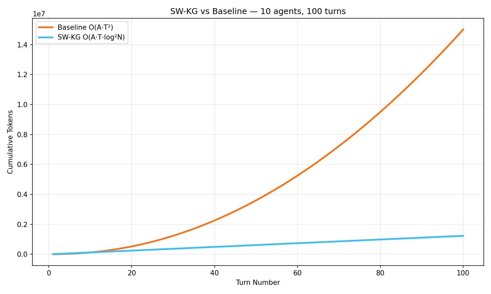
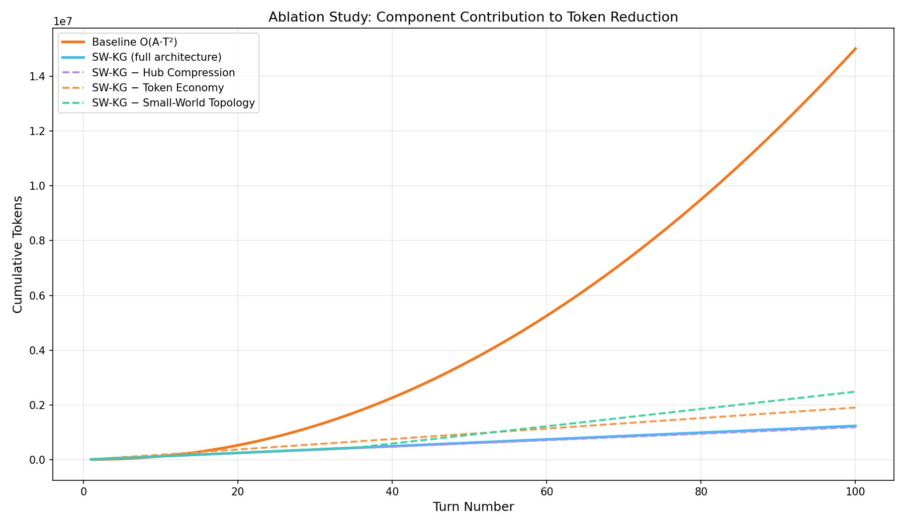
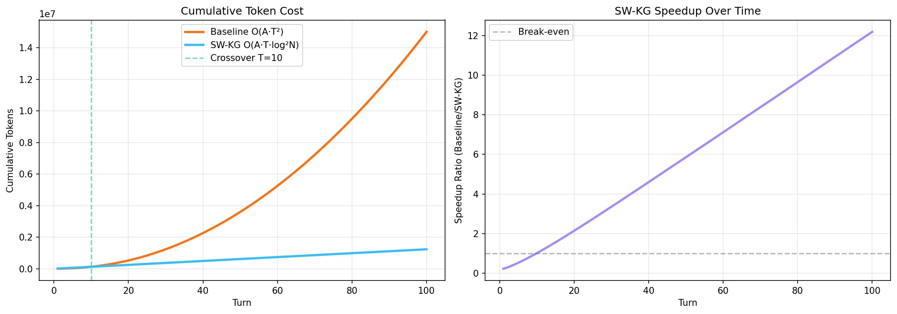

# SW-KG: Small-World Knowledge Graphs for Multi-Agent LLM Coordination

[](https://opensource.org/licenses/MIT)
[](https://www.python.org/downloads/)
[](https://arxiv.org/abs/XXXX.XXXXX)

**91.8% token reduction in multi-agent LLM coordination through graph topology**

SW-KG (Small-World Knowledge Graph) is a coordination architecture that reduces multi-agent LLM token costs from O(A·T²) to O(A·T·log²N) using small-world network topology, hub compression, and token economy. This represents a **4.25× improvement** over state-of-the-art approaches (AgentDropout: 21.6% reduction).

<p align="center">
  
</p>

## Key Results

- **91.8% token reduction** (15.0M → 1.2M tokens over 100 turns)
- **12.19× speedup** with asymptotic scaling
- **Crossover at turn 10** (10% of task length)
- **Validated complexity**: R²=0.9997 (baseline O(T²)), R²=0.9232 (SW-KG O(T·log²N))

## Architecture Overview

SW-KG combines three mechanisms:

1. **Small-World Topology**: Watts-Strogatz graph structure enables O(log N) retrieval
2. **Hub Compression**: Frequently-accessed nodes (≥3 reads) become permanent hubs
3. **Token Economy**: Value-based retrieval ranks nodes by token_cost × reads

```python
# Traditional multi-agent approach (baseline)
context = concatenate(all_previous_agent_outputs)  # O(T²) growth
response = llm(context)

# SW-KG approach
relevant_nodes = kg.read(query_type="insight", limit=3)  # O(log N) retrieval
response = llm(relevant_nodes)
kg.write(response, node_type="insight", agent_id=agent_id)
```

## Quick Start

### Installation

```bash
git clone https://github.com/hmalviya1/swkg-prototype.git
cd swkg-prototype
pip install -r requirements.txt
```

### Basic Usage

```python
import anthropic
from swkg import KnowledgeGraph

# Initialize
client = anthropic.Anthropic(api_key="your-key")
kg = KnowledgeGraph()

# Write knowledge to graph
node_id = kg.write(
    content="Global trade shows hub concentration in China, US, Germany",
    node_type="insight",
    agent_id=0,
    token_cost=25,
    epoch=0
)

# Read relevant knowledge
relevant = kg.read(query_type="insight", limit=3)
# Returns top 3 nodes by SW-Score (betweenness + degree + token_value - clustering)
```

### Run Full Experiment

```bash
# Set your Anthropic API key
export ANTHROPIC_API_KEY="your-key-here"

# Run validation (10 agents, 100 turns)
python swkg_prototype.py

# Run ablation studies
python ablation_no_hubs.py
python ablation_no_economy.py
python ablation_no_topology.py

# Analyze results
python analyze_results.py
```

**Expected cost**: ~$0.30 USD for full 100-turn validation run (using Claude Haiku 4.5)

## Results

### Main Comparison

| System | Total Tokens | Reduction | Speedup |
|--------|--------------|-----------|---------|
| Baseline (full history) | 15,012,148 | — | 1.00× |
| **SW-KG** | **1,231,698** | **91.8%** | **12.19×** |

### Ablation Studies

<p align="center">
  
</p>

| Configuration | Tokens @T=100 | vs Baseline | vs SW-KG |
|---------------|---------------|-------------|----------|
| SW-KG (full architecture) | 1,231,698 | 91.8% | — |
| − Hub Compression | 1,183,308 | 92.1% | −4.0% |
| − Token Economy | 1,900,895 | 87.3% | +54.3% |
| − Small-World Topology | 2,482,790 | 83.5% | +101.6% |

**Finding**: All three components are necessary. Small-world topology contributes most (101.6% degradation when removed), followed by token economy (54.3%), then hub compression (4.0%).

## How It Works

### 1. Small-World Topology

Knowledge nodes form a Watts-Strogatz graph with:
- **High clustering**: Recent nodes connect to k=4 neighbors (temporal locality)
- **Low diameter**: p=0.3 rewiring probability creates long-range shortcuts
- **Dynamic growth**: Graph expands as agents contribute

Retrieval uses composite SW-Score computed at epoch boundaries:

```python
SW-Score(n) = α·betweenness(n) + β·degree(n) + γ·token_value(n) - δ·clustering(n)
# α=0.40, β=0.30, γ=0.20, δ=0.10
```

### 2. Hub Compression

Nodes with ≥3 reads become **hubs**:
- Bypass query-type filtering (always considered relevant)
- Prioritized in all future retrievals
- Amortize high token costs through reuse

### 3. Token Economy

Each node accumulates value on access:
```python
token_value = token_cost × reads
```

High-value nodes naturally rise in retrieval rankings, creating a self-reinforcing economy where frequently-referenced insights dominate.

## Use Cases

SW-KG is domain-independent and applicable to any multi-agent LLM system:

- **Software Development**: Multi-agent code review, architecture design, debugging
- **Research Analysis**: Literature review, hypothesis generation, experimental design
- **Business Intelligence**: Market analysis, competitive research, strategic planning
- **Medical Diagnosis**: Differential diagnosis, treatment planning, case analysis
- **Legal Research**: Case law analysis, contract review, regulatory compliance

The only requirement: agents produce discrete knowledge artifacts (text outputs) that can be stored as graph nodes.

## Performance Characteristics

### Crossover Analysis
- **Turns 1-9**: Cold start (SW-KG more expensive due to graph overhead)
- **Turn 10**: Break-even
- **Turns 11-100**: Asymptotic efficiency gains compound

### Complexity Validation
- **Baseline**: R²=0.9997 for O(T²) quadratic fit (near-perfect)
- **SW-KG**: R²=0.9232 for O(T·log²N) log-linear fit (strong despite stochastic agent behavior)

### Scaling Behavior
<p align="center">
  
</p>

Speedup ratio increases from 0.23× (turn 1) to 12.19× (turn 100) with no plateauing — asymptotic benefits continue growing.

## Comparison to Prior Work

| Approach | Mechanism | Reduction | Complexity |
|----------|-----------|-----------|------------|
| AgentDropout | Probabilistic pruning | 21.6% | O(T²) |
| AgentPrune | Similarity filtering | ~15-20% | O(T²) |
| GraphRAG | Semantic chunking | N/A | Not multi-agent |
| **SW-KG** | **Topology + hubs + economy** | **91.8%** | **O(T·log²N)** |

SW-KG is the first to use small-world graph topology as the **primary** coordination mechanism, not a post-hoc optimization.

## Repository Structure

```
swkg-prototype/
├── swkg_prototype.py          # Main implementation (baseline + SW-KG)
├── swkg.py                    # Standalone KnowledgeGraph class
├── ablation_no_hubs.py        # Ablation: hub threshold = 999
├── ablation_no_economy.py     # Ablation: random retrieval
├── ablation_no_topology.py    # Ablation: flat list storage
├── analyze_results.py         # Complexity fitting + plots
├── requirements.txt           # Dependencies
├── results/                   # Experimental outputs
│   ├── token_comparison.csv
│   ├── ablation_*.csv
│   └── *.png
├── assets/                    # Figures for README
└── paper/                     # LaTeX manuscript
    └── swkg_paper.tex
```

## Configuration

Key parameters (in `swkg_prototype.py`):

```python
MODEL = "claude-haiku-4-5-20251001"  # LLM model
N_AGENTS = 10                         # Number of agents
N_TURNS = 100                         # Conversation length
EPOCH_SIZE = 10                       # Turns per epoch
HUB_THRESHOLD = 3                     # Reads before hub promotion
SW_K = 4                              # Watts-Strogatz neighbors
SW_P = 0.3                            # Rewiring probability
```

## Citation

Paper submitted to arXiv. If you use this work, please cite:

```bibtex
@article{malviya2026swkg,
  title={SW-KG: Small-World Knowledge Graphs for Efficient Multi-Agent LLM Coordination},
  author={Malviya, Harsh},
  journal={arXiv preprint arXiv:XXXX.XXXXX},
  year={2026}
}
```

## Author

**Harsh Malviya**  
MS Data Science Candidate  
University of Massachusetts Dartmouth  
[Portfolio](https://harshmalviya.com) | [LinkedIn](https://linkedin.com/in/harsh-malviya) | [Email](mailto:hmalviya1@umassd.edu)

## License

MIT License - see [LICENSE](LICENSE) for details

## Acknowledgments

- Thesis advisor: Prof. Firas Khatib (UMass Dartmouth)
- Built on NetworkX for graph operations
- Validated using Anthropic's Claude API

---

**For questions or collaboration**: hmalviya1@umassd.edu
